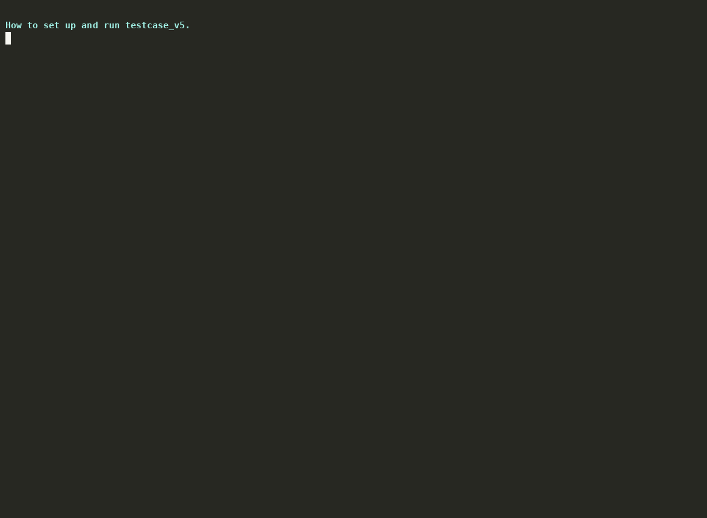

# Running testcase_v5

testcase_v5 drives a read-heavy InnoDB workload against a source and its replica.
It reads from the replica and writes to the source, which is where the mysqld
crash we're chasing shows up. You point it at a source and replica you already
have, seed a table, and let it run.



## Install

You need Go 1.25 or newer to build it. Clone the repo and build the static Linux
binary:

```bash
git clone https://github.com/matias-sanchez/pt-simulates.git
cd pt-simulates/testcase_v5
make build-linux
```

That gives you `build/tc-repro-linux-amd64`, a single static binary with no
dependencies. Copy it to the host you want to run it from. That host can be the
replica itself or any box that can reach both servers.

## What you need on the database side

A source and a replica (Percona Server / MySQL 8.0) with replication running.
The tool uses two accounts. Create them on the source and they replicate to the
replica:

```sql
-- writes, on the source
CREATE USER 'tcwrite'@'%' IDENTIFIED BY '…';
GRANT CREATE, DROP, ALTER, INDEX, INSERT, UPDATE, SELECT, DELETE ON repro_db.* TO 'tcwrite'@'%';
GRANT SYSTEM_VARIABLES_ADMIN ON *.* TO 'tcwrite'@'%';   -- the seeder does a SET GLOBAL

-- reads, on the replica
CREATE USER 'tcread'@'%' IDENTIFIED BY '…';
GRANT SELECT ON repro_db.* TO 'tcread'@'%';
GRANT REPLICATION CLIENT ON *.* TO 'tcread'@'%';
```

Two settings are worth checking:

- `max_allowed_packet = 256M` on the source. The seeder sends large batches.
- `innodb_buffer_pool_in_core_file = ON` on the replica, plus `core-file` and a
  writable core pattern, so a crash core carries the buffer pool.

## Configure

Everything you set lives in one file. Copy the template and fill it in:

```bash
cp tc_config.json tc_config.local.json
```

**The two servers.** Writes go to the source, reads to the replica, both on the
same table `repro_db.files`:

```json
"database": {
  "write": { "host": "SOURCE_HOST",  "port": 3306, "user": "tcwrite", "password": "…", "schema": "repro_db", "table": "files", "socket": "" },
  "read":  { "host": "REPLICA_HOST", "port": 3306, "user": "tcread",  "password": "…", "schema": "repro_db", "table": "files", "socket": "" }
}
```

**How much data to load.** The row count is `init.tenants` × `init.rows_per_tenant`.
Fifty tenants of twenty thousand rows is a million:

```json
"init": { "tenants": 50, "rows_per_tenant": 20000, … }
```

Want more data, raise `rows_per_tenant` (or `tenants`).

**How much load to drive.** These are the worker counts. The read side hits the
replica with the three query shapes the crash comes from:

```json
"run": { "search_mix": { "enabled": true, "forward_refscan_workers": 64, "range_estimate_workers": 16, "mrr_workers": 16 } }
```

The write side hits the source. Turn on the noise sidecar for a steady stream of
inserts and updates:

```json
"noise": { "enabled": true, "insert_workers": 16, "update_workers": 32 }
```

Raise any of those numbers and you get more sessions running at once.

**How long it runs.** `safety.max_runtime_seconds`. Use `259200` for 72 hours,
or `0` to stop after one backfill pass.

## Seed the table

Run this once. It creates `repro_db.files` and loads the rows:

```bash
./build/tc-repro-linux-amd64 --config tc_config.local.json init
```

## Run it

In the foreground:

```bash
./build/tc-repro-linux-amd64 --config tc_config.local.json run
```

To leave it running on its own and let it capture a crash, use the supervisor.
It runs in the background, keeps its logs under `run-state/`, and only stops if
mysqld crashes:

```bash
TC_CONFIG=./tc_config.local.json \
MYSQL_ERROR_LOG=/var/log/mysql/error.log \
CORE_DIR=/var/lib/mysql/cores \
TC_VERB=run ./run-unattended.sh
```

Seeding and running back to back is `TC_VERB=start`.

## Check it's working

Look at the live sessions. Writes on the source:

```bash
mysql -h SOURCE_HOST -e "
  SELECT id, user, command, LEFT(info,60)
  FROM information_schema.processlist
  WHERE command IN ('Query','Execute') AND info LIKE '%files%' LIMIT 10"
```

Reads on the replica. This is the workload the crash comes from:

```bash
mysql -h REPLICA_HOST -e "
  SELECT id, user, LEFT(info,90)
  FROM information_schema.processlist
  WHERE user = 'tcread' AND info LIKE '%files%' LIMIT 10"
```

The harness has its own view as well:

```bash
./build/tc-repro-linux-amd64 --config tc_config.local.json status
./build/tc-repro-linux-amd64 --config tc_config.local.json tail
cat run-state/STATUS
```

## If it crashes

mysqld's core lands in the directory you set as `CORE_DIR`, and the supervisor
writes `run-state/CRASH_DETECTED` and stops. Confirm the signature in gdb:
signal 11, `pthread_self`, `btr_cur_search_to_nth_level`. A core taken with the
buffer pool in it holds real table rows, so handle it as production data.

## Stop it

```bash
pkill -f run-unattended.sh ; pkill -f tc-repro-linux
```

## One thing to keep in mind

This reproduces the workload, not the crash itself. A clean run means the
workload ran as expected, nothing more. The crash needs a condition you can't
force from SQL.
